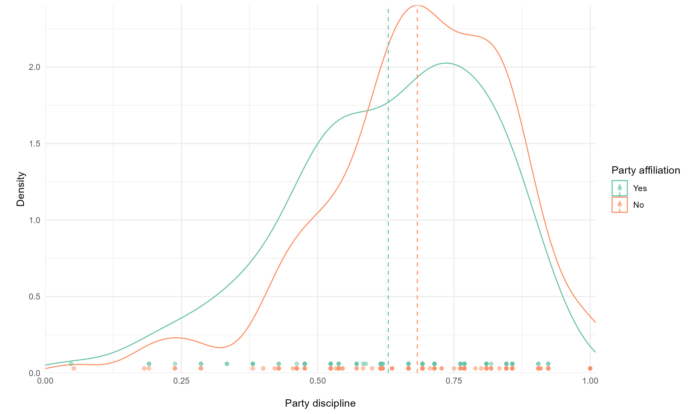
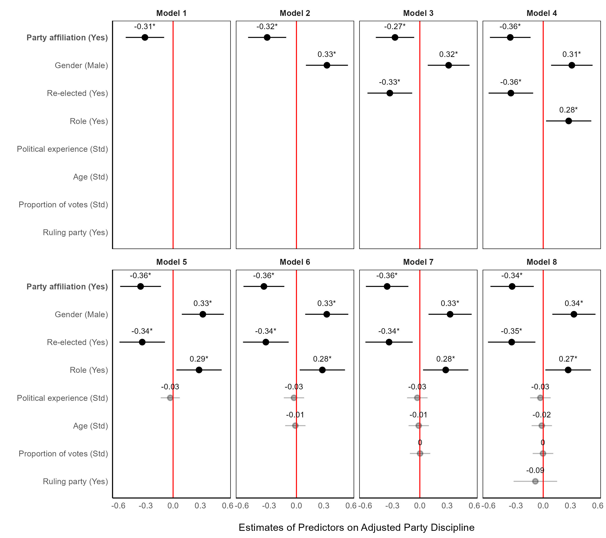
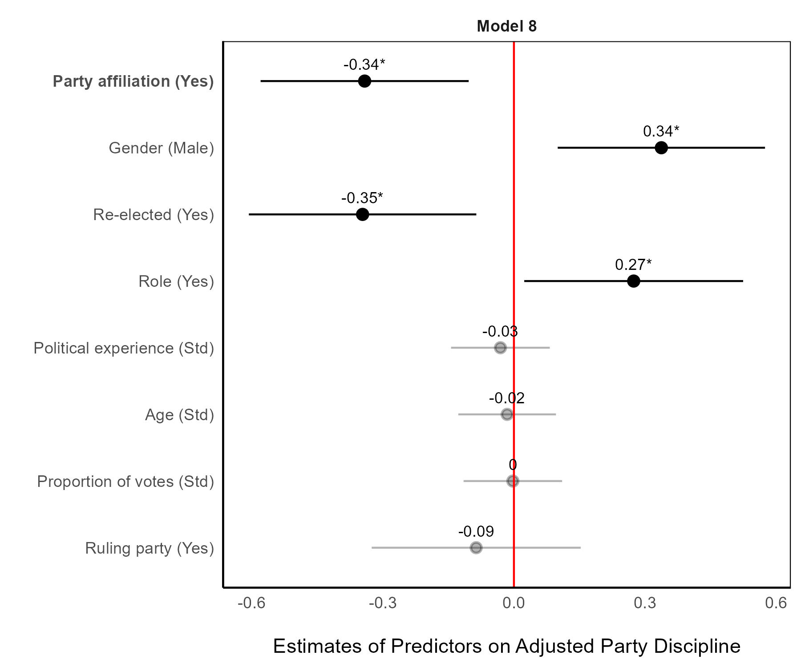
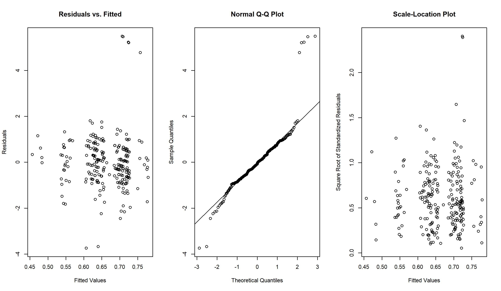

# Unravelling Party Discipline in the Global South: A Case Study of Peru Using Beta Regression Analysis

[](https://orcid.org/0000-0002-4673-0565)  [](https://github.com/cristhianjaramillo)  [](https://twitter.com/schrodingercase)  [](https://www.linkedin.com/in/cristhian-jaramillo-00888aa6/)  [](https://www.researchgate.net/profile/Cristhian-Jaramillo-2)  [](https://figshare.com/authors/Cristhian_Jaramillo/8189448)


Bienvenido al repositorio de GitHub para la tesis titulada "Unravelling Party Discipline in the Global South: A Case Study of Peru Using Beta Regression Analysis" por Cristhian Jaramillo, realizada como parte del programa MSc Social Research Methods en la London School of Economics and Political Science.

Para descargar la tesis completa, puedes hacerlo aquí [**aquí**](https://www.researchgate.net/publication/384898837_Unravelling_Party_Discipline_in_the_Global_South_A_Case_Study_of_Peru_Using_Beta_Regression_Analysis)

## Tabla de Contenidos

-   [Descripción](#descripción)
-   [Información para citar](#información-para-citar)
-   [Raw data](#raw-data)
-   [Data final](#data-final)
-   [Código](#código)

## Descripción

Este repositorio contiene todos los materiales utilizados en la creación de la tesis mencionada. La principal pregunta de investigación abordada en este estudio es: "¿El control partidario, cuantificado a través de la afiliación partidaria (variable independiente), se correlaciona positivamente con la disciplina partidaria (variable dependiente) en el contexto peruano (2011-2019)?"

Para probar esta hipótesis y arrojar luz sobre la pregunta de investigación, la tesis recopila datos del sitio oficial del [Congreso del Perú](https://www.leyes.congreso.gob.pe) y del [Jurado Nacional de Elecciones](https://infogob.jne.gob.pe). El estudio construye un índice de disciplina partidaria, enfocándose exclusivamente en los comportamientos de voto de los congresistas en mociones de confianza, censura e interpelación. La selección de estos votos se fundamenta en su relevancia y posible impacto tanto en el Congreso como en el Gabinete Ejecutivo. Dado que este índice está entre 0 y 1, se utiliza una **regresión beta** para evaluar la hipótesis.

Los predictores de este modelo incluyen el control del partido sobre sus miembros y varias variables de control. En el contexto peruano, la evaluación del control del partido sobre los congresistas implica un examen de su afiliación partidaria. La afiliación refleja la adhesión de un individuo a las normas internas estipuladas por su partido. Por tanto, la manifestación del control partidario puede inferirse mediante la presencia o ausencia de afiliación. Las variables de control incluyen género, edad, proporción de votos, experiencia política, reelección, rol en el partido y afiliación al partido gobernante. Estas variables se seleccionaron por su relevancia en la literatura sobre disciplina partidaria y su disponibilidad en los sitios web mencionados. El índice de disciplina partidaria se ajustó para evitar valores exactos de 1, facilitando la regresión beta, y las variables de control continuas se estandarizaron.

## Información para citar

El conjunto de datos usado para construir el índice de disciplina partidaria del Congreso del Perú, que abarca de 2011 a 2019, se puede citar de la siguiente manera. En principio, este repositorio proporciona un archivo [.ris](https://github.com/cristhianjaramillo/dissertation_partydiscipline-esp/blob/main/Peruvian_Party_Discipline_Index.ris) para su descarga. Cargue el archivo a su programa de referencias preferido (Mendeley, Zotero u otros) y selecciona el estilo de cita que se alinee con tus preferencias y necesidades.

<details>

<summary>Chicago style</summary>

``` r
Jaramillo, Cristhian. 2023. "Peruvian Parliamentary Party Discipline Index Dataset (2011-2019)." figshare. Dataset. [https://doi.org/10.6084/m9.figshare.24549274.v2](https://doi.org/10.6084/m9.figshare.24549274.v2).
```

</details>

<details>

<summary>APA style</summary>

``` git
Jaramillo, C. (2023). *Peruvian Parliamentary Party Discipline Index Dataset (2011-2019)*. figshare. [https://doi.org/10.6084/m9.figshare.24549274.v2](https://doi.org/10.6084/m9.figshare.24549274.v2)
```

</details>

<details>

<summary>Harvard style</summary>

``` git
Jaramillo, Cristhian. *Peruvian Parliamentary Party Discipline Index Dataset (2011-2019)*. figshare, 2023. [https://doi.org/10.6084/m9.figshare.24549274.v2](https://doi.org/10.6084/m9.figshare.24549274.v2)
```

</details>

<details>

<summary>IEEE Style</summary>

``` r
C. Jaramillo, "Peruvian Parliamentary Party Discipline Index Dataset (2011-2019)," figshare, 2023. [https://doi.org/10.6084/m9.figshare.24549274.v2](https://doi.org/10.6084/m9.figshare.24549274.v2)
```

</details>

## Raw data

El directorio `./Raw Data/` contiene los datos originales extraídos de las mociones de confianza, censura e interpelación. Cada archivo en este directorio es un PDF que documenta el comportamiento de voto de los 130 congresistas. Es importante señalar que cada PDF está en español, y la siguiente tabla proporciona una descripción detallada de los datos.

|           | Interpelaciones | Mociones de Confianza | Mociones de Censura | Total |
|---------------|:-------------:|:-------------:|:-------------:|:-------------:|
| 2011-2016 |       19        |          1           |            1            |  21   |
| 2016-2019 |        8        |          4           |            1            |  13   |
| Total     |       27        |          5           |            2            |  34   |

## Data final

El directorio `./Final Data/` incluye dos archivos. El archivo `./Final Data/party_discipline_index` contiene información completa sobre el comportamiento de voto de cada congresista en las mociones seleccionadas. Específicamente, incluye las siguientes variables:

-   `Surname 1`: Primer apellido del congresista.
-   `Surname 2`: Segundo apellido del congresista.
-   `Names`: Nombre completo del congresista.
-   `Political party`: Partido político por el que fue elegido el congresista.
-   `Interpellations, motions of confidence, and motion of no confidence`: Registro de todos los votos emitidos por cada congresista. Un valor de 1 indica que el voto fue acorde con la mayoría del partido político, mientras que 0 representa un voto en contra de la mayoría del partido. Cada voto está asociado con el partido político del congresista.
-   `Number of times MP´s vote aligns with their party`: Suma de todos los votos disciplinados, que indica las veces que el congresista votó en línea con su partido.
-   `Total of votes`: Número total de procedimientos de votación en los que participó el congresista.
-   `Party discipline`: Índice de disciplina partidaria individual, calculado como la proporción del número de veces que el voto del congresista coincide con su partido respecto al número total de votos.

En la sección `./Final Data/` encontrarás el archivo Excel `./Final Data/final_dataset`, que consta de cuatro hojas: `2011_total`, `2016_total`, `FINAL` y `FINAL_edited`. A continuación se presenta una descripción de cada hoja:

**`2011_total` y `2016_total`:** Estas hojas proporcionan conjuntos de datos detallados para los periodos legislativos de 2011-2016 y 2016-2019, respectivamente. Incluyen todas las variables necesarias para el análisis.

**`FINAL`:** Esta hoja consolida ambos periodos, enfocándose exclusivamente en los congresistas elegidos originalmente. Excluye a las personas que ocuparon escaños debido a renuncias, muertes o la incapacidad de completar su mandato de otros congresistas.

**`FINAL_edited`:** El conjunto de datos utilizado en este estudio se encuentra en esta hoja. Incluye solo a los congresistas que completaron su mandato con éxito y que cuentan con suficiente información para el estudio. Los congresistas que no cumplieron su mandato o se incorporaron en las etapas finales de los periodos legislativos se omiten de este conjunto de datos.

Estos conjuntos de datos incluyen una variedad de variables que proporcionan una visión completa del panorama parlamentario:

-   `year`: Año correspondiente.
-   `Surname 1`: Primer apellido del congresista.
-   `Surname 2`: Segundo apellido del congresista.
-   `Names`: Nombre completo del congresista.
-   `party`: Partido político por el que fue elegido el congresista.
-   `party_discipline`: Índice de disciplina partidaria, calculado en el conjunto de datos **party_discipline_index**.
-   `party_affiliation`: Afiliación partidaria de cada congresista, donde 1 significa afiliación al partido político y 0 indica no afiliación.
-   `gender`: Género del congresista.
-   `birth`: Fecha de nacimiento del congresista.
-   `election_date`: Fecha de la elección en la que fue elegido el congresista.
-   `age`: Edad del congresista en la fecha de la elección.
-   `pol_experience`: Experiencia política de cada congresista, medida por el número de elecciones en las que participó.
-   `role`: Rol del congresista en el partido político, con 1 indicando que tiene un rol (por ejemplo, líder del partido) y 0 indicando que no lo tiene.
-   `number_parties`: Número de partidos políticos a los que el congresista ha estado afiliado en el pasado.
-   `re_elected`: Indica si el congresista fue reelecto (1 para sí, 0 para no).
-   `votes`: Número de votos obtenidos por el congresista.
-   `prop_votes`: Proporción de votos obtenidos por el congresista, calculada dividiendo el número total de votos obtenidos por el congresista entre el número total de votos obtenidos por su partido político en el respectivo distrito electoral.
-   `rule`: Indica si el congresista pertenece al partido gobernante (1 para sí, 0 para no).

## Código

El directorio `./Code/` contiene dos scripts separados para replicar cada figura analítica presentada en la tesis. El directorio `./Figures/` incluye una copia de cada una de las figuras generadas por estos scripts.

-   [analysis_descriptive_beta.R](https://github.com/cristhianjaramillo/dissertation_partydiscipline-esp/blob/main/Code/analysis_descriptive_beta.R): Este archivo R está diseñado para generar un gráfico de densidad, que evalúa la distribución de la variable de disciplina partidaria según la afiliación partidaria. También proporciona una representación detallada de todos los modelos de regresión beta creados y una descripción minuciosa del Modelo 8.







-   [evaluation.R](https://github.com/cristhianjaramillo/dissertation_partydiscipline-esp/blob/main/Code/evaluation.R): Este archivo R contiene la sección de evaluación del modelo, presentando valores de AIC y BIC. Además, incluye una figura detallada que muestra gráficos de diagnóstico para el modelo de regresión beta, abarcando los residuales, la normalidad y la homocedasticidad.


